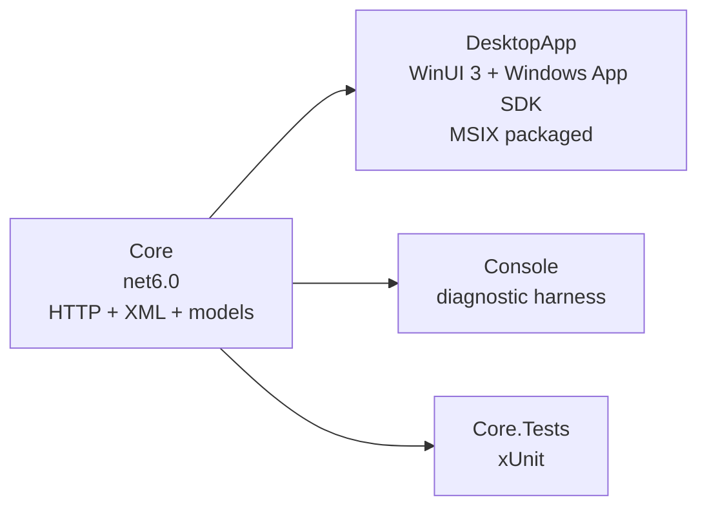
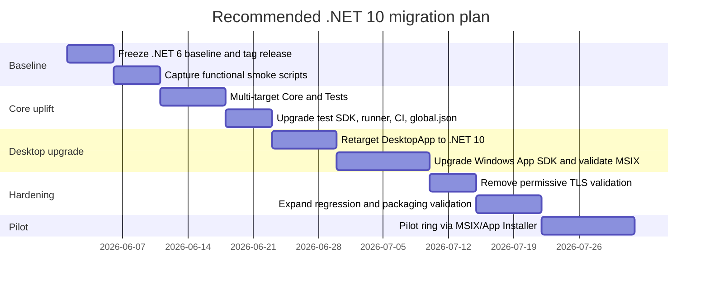

# Porting a .NET 6 Windows Desktop App to .NET 10 LTS

## Executive summary

The attached inventory resolves the UI-framework ambiguity: this application is **already a WinUI 3 / Windows App SDK packaged desktop app**, not WPF, MAUI, or WinForms. It consists of a UI project (`DesktopApp`), a UI-free core library, a console harness, and xUnit tests; it uses MVVM Toolkit, Newtonsoft.Json, Serilog file logging, manual composition rather than `Microsoft.Extensions.DependencyInjection`, and single-project MSIX-style settings such as `UseWinUI` and `EnableMsixTooling`. It also currently targets .NET 6, which has been out of support since **November 12, 2024**, while .NET 10 is an active **LTS** release supported through **November 14, 2028**. fileciteturn0file0 citeturn11view0turn3view0

For this codebase, **Scenario A — upgrade to .NET 10 while keeping WinUI 3 — is the recommended path**. The reason is structural, not stylistic: the app’s UI, navigation shell, dispatcher abstraction, converters, MVVM state model, and packaged deployment model are already aligned with WinUI 3. In practice, Scenario A is mostly a **target-framework, package, tooling, testing, and security-hardening** exercise. Scenario B — convert to WinForms — is viable, but it is a **real UI rewrite** with meaningfully higher delivery risk, larger regression surface, and weaker UI fidelity to the current WinUI design. fileciteturn0file0 citeturn35view0turn38view0turn38view1turn39view0

The most important non-negotiable remediation, regardless of scenario, is **security hardening of HTTP certificate validation**. The inventory shows that the current HTTP sender accepts any TLS certificate via `ServerCertificateCustomValidationCallback = (_, _, _, _) => true`, which defeats normal server-authentication guarantees and should not survive the migration except in tightly controlled development-only configurations. fileciteturn0file0

A realistic overall estimate is:

| Scenario | Overall effort | Delivery risk | Recommended? | Why |
|---|---|---:|---|---|
| Keep WinUI 3 on .NET 10 | **Medium** | **Medium** | **Yes** | Preserves UI architecture, package identity, and current user experience; most work is mechanical plus regression testing and package refresh. fileciteturn0file0 citeturn35view0turn3view1turn46view2 |
| Convert to WinForms on .NET 10 | **High** | **High** | **Only if strategically mandated** | Requires replatforming navigation, layout, binding, dispatcher usage, event wiring, and UI automation, with no strong evidence of business benefit for this app. fileciteturn0file0 citeturn32view0turn34view0turn47view0turn47view2turn39view0 |

## Baseline from the inventory

The codebase is small enough to port in a controlled way, but it has a few characteristics that matter disproportionately to migration risk. The core domain/client project is already UI-free and should therefore move first. The desktop project is a packaged WinUI 3 app using XAML pages, `NavigationView`, `DispatcherQueue`, MVVM Toolkit commands/messages, and JSON-backed local settings. The test project currently covers only `Ean13Helper` and `ModelConverter`, so behavioral coverage is relatively thin compared with the number of user-facing workflows in the UI. CI is GitHub Actions using `actions/setup-dotnet@v1` and MSBuild to build the MSIX artifact. Nullable reference types are **not** enabled today. fileciteturn0file0

That baseline implies three practical things. First, the app is **already organized for phased migration** because `Core` and `Console` are separable from the UI. Second, the main technical uncertainty is **not** core .NET API survivability; it is the combination of **Windows App SDK version movement, packaging behavior, analyzer/SDK drift, and regression coverage**. Third, the report must treat **native dependencies, P/Invoke, and COM** as mostly precautionary topics, because the inventory does not enumerate any direct native DLL set or explicit P/Invoke surface beyond normal Windows App SDK / WinRT consumption. If hidden native pieces exist outside the inventory, interop and packaging risk rises materially. fileciteturn0file0 citeturn3view1turn45view0turn46view2

The current architecture is conceptually straightforward:



That decomposition, visible in the inventory, is the biggest reason the migration should begin with **Core → Tests → Console → DesktopApp** rather than by touching XAML first. Microsoft’s desktop migration guidance also recommends upgrading lower-dependency projects first, which matches this solution shape. fileciteturn0file0 citeturn9view2turn9view3

## Scenario A retains WinUI 3 and upgrades to .NET 10

This is the lowest-risk path because it preserves the parts of the system that are hardest to rewrite correctly: XAML views, page navigation, view-model composition, `DispatcherQueue` usage, packaged storage assumptions, and the existing WinUI shell. The required work is mostly **retargeting**, **package refresh**, **MSIX validation**, **CI modernization**, and **regression/security cleanup**, not conceptual UI migration. fileciteturn0file0 citeturn35view0turn38view0turn38view1turn25view0

The compatibility story from .NET 6 to .NET 10 is favorable for this application. The app mainly uses stable BCL and platform APIs—`HttpClient`, async/await, LINQ to XML, logging abstractions, file I/O, and MVVM Toolkit patterns—which remain available. The important changes are concentrated in the **SDK/MSBuild toolchain** and in the **Windows App SDK line**, not in wholesale removal of APIs the app is obviously using. Relevant .NET 7–10 changes include new source-incompatible obsoletions, transitive package auditing during restore, stricter package validation, SDK behavioral changes, CLI behavior changes, and new MSBuild behavior. Because this solution also sets `AnalysisLevel=latest`, upgrading the SDK will likely surface **more diagnostics immediately**, which is desirable but must be budgeted into the port. fileciteturn0file0 citeturn8view0turn8view1turn45view0turn46view2

The minimum project-file changes are straightforward:

| Project | Current | Recommended target | Notes |
|---|---|---|---|
| `Core` | `net6.0` | `net10.0` | Lowest-risk first move. Temporarily multi-targeting `net6.0;net10.0` is useful for phased rollout and rollback. fileciteturn0file0 |
| `Console` | `net6.0` | `net10.0` | Simple retarget once `Core` is green on .NET 10. fileciteturn0file0 |
| `Core.Tests` | `net6.0` | `net10.0` | Upgrade test SDK/runner in same pass. fileciteturn0file0 citeturn42view1turn43view3turn42view3turn43view5 |
| `DesktopApp` | `net6.0-windows10.0.19041.0` | `net10.0-windows10.0.19041.0` initially | Keep the Windows-specific TFM and preserve `UseWinUI` / `EnableMsixTooling`; only raise the Windows OS version floor if you intentionally want Windows 11-only inbox APIs. fileciteturn0file0 citeturn35view0 |

A representative `DesktopApp.csproj` end-state is likely to look like this:

```xml
<Project Sdk="Microsoft.NET.Sdk">
  <PropertyGroup>
    <OutputType>WinExe</OutputType>
    <TargetFramework>net10.0-windows10.0.19041.0</TargetFramework>
    <UseWinUI>true</UseWinUI>
    <EnableMsixTooling>true</EnableMsixTooling>

    <!-- Add once the mechanical port is stable -->
    <!-- <Nullable>enable</Nullable> -->

    <!-- Strongly recommended -->
    <LangVersion>default</LangVersion>
  </PropertyGroup>
</Project>
```

This scenario does **not** require adopting C# 14 features. .NET 10 brings C# 14, but the code can continue compiling in its existing style. The inventory shows the codebase currently uses C# 10-era idioms and does not enable nullable reference types; that means the safest approach is to treat **nullable enablement as a second-stage cleanup**, not part of the first green build. Otherwise, the mechanical port gets mixed with a cross-cutting correctness refactor. fileciteturn0file0 citeturn3view0

Package work in Scenario A is meaningful, but manageable:

| Dependency area | Current inventory | Migration action | Assessment |
|---|---|---|---|
| `CommunityToolkit.Mvvm` | 8.2.2 | Upgrade to current 8.4.x line and recompile generated code/analyzers. NuGet shows compatibility through newer .NET TFMs via `net8.0` + `netstandard2.0`. | **Low risk**. The app is built around this package, but its API surface is stable and mainstream. fileciteturn0file0 citeturn15view0 |
| `CommunityToolkit.WinUI` | 7.1.2 | Prefer upgrade if available; if awkward, replace its `DispatcherQueue.EnqueueAsync` usage with a tiny local helper over `DispatcherQueue.TryEnqueue`. | **Low to medium risk** because actual usage is tiny in this app. fileciteturn0file0 citeturn38view0 |
| `Microsoft.WindowsAppSDK` | 1.4.230913002 | Upgrade as a deliberate milestone, not opportunistically. NuGet currently lists a much newer Microsoft.WindowsAppSDK package line, so expect runtime/control/template regression testing. | **Medium to high risk**, and the biggest scenario-specific technical variable. fileciteturn0file0 citeturn15view2turn16view1 |
| `Newtonsoft.Json` | 13.0.3 | Upgrade to current stable 13.0.4 or retain 13.0.3 briefly; compatibility is not a blocker. | **Low risk**. fileciteturn0file0 citeturn42view0 |
| `Serilog.Extensions.Logging.File` | 3.0.0 | Short term: keep and verify. Medium term: consider replacing with a more current Serilog configuration if desktop logging requirements grow. | **Low functional risk, medium maintenance risk**; NuGet still lists 3.0.0 as current and compatibility comes via `netstandard2.0`. fileciteturn0file0 citeturn15view3turn16view5 |
| Test tooling | xUnit 2.6.4, runner 2.5.6, `Microsoft.NET.Test.Sdk` 17.8.0 | Move to a current test SDK and runner before relying on green CI; .NET 10 SDK also adds `dotnet test` support for Microsoft.Testing.Platform. | **Medium risk** due to test-runner/tooling drift rather than test code. fileciteturn0file0 citeturn3view0turn42view1turn43view3turn42view3turn43view5 |

UI-specific migration work in Scenario A is intentionally limited. Keep the existing XAML pages, `NavigationView`, converters, messenger, commands, and view models. The app already wraps thread marshalling behind `IUiThreadDispatcher`, and `DispatcherQueue` is explicitly designed to execute tasks serially on the associated thread. That means the migration should preserve the abstraction and only change its implementation if the CommunityToolkit extension package becomes a nuisance. The inventory also shows WinUI-specific elements such as `InfoBar`, `Symbol`, `Page`, `UserControl`, `NavigationView`, and `DispatcherQueue` are real, current dependencies, so avoiding UI replatforming is where most schedule is saved. fileciteturn0file0 citeturn38view0turn38view1

Packaging is a strong reason to prefer Scenario A. The application is already packaged and already stores settings/logs under app-data conventions tied to its packaged runtime behavior. Microsoft’s current Windows guidance positions **MSIX** as the modern packaging format for reliable install/uninstall, clean updates, differential updates, and package identity, and Windows App SDK guidance explicitly supports **single-project MSIX** for packaged WinUI desktop apps. Because the current solution already resembles that model, I would keep **MSIX as the primary Windows 11 distribution format**, and use **App Installer** for enterprise-style update delivery. Also note that the `ms-appinstaller:` URI protocol has been disabled by default on most devices since December 2023, so distribution should use a direct `.appinstaller` file rather than a browser-trigger protocol shortcut. fileciteturn0file0 citeturn25view0turn26view0turn35view0

Interop risk in this scenario appears low **as documented**, because the inventory does not list a native DLL set or explicit P/Invoke/COM layer. Still, if hidden interop exists, the modern recommendation is to prefer `[LibraryImport]` over `[DllImport]` where feasible, and `SafeHandle` over raw handle lifetime management. If COM becomes relevant, .NET now supports both the classic built-in COM system and newer `ComWrappers` / COM source-generation options. None of that should block the current app, but it belongs on the checklist if native pieces appear during implementation. fileciteturn0file0 citeturn40view0turn40view1turn49view0

Testing in Scenario A should expand more than the code does. The inventory shows unit coverage for helper/model conversion code, but not for the UI workflows that users actually exercise. I would keep xUnit, upgrade its runner/test SDK, and add a Windows 11 smoke suite that verifies: login/session acquisition, product search, edit/save/delete flows, bulk XML backup, settings persistence, and packaged install/update/uninstall. If UI automation is not yet available, start with scripted integration smoke tests against the core/service layer and a small set of install-time/manual acceptance scripts. The important point is that the migration should **increase confidence**, not just change the TFM. fileciteturn0file0 citeturn42view1turn43view3turn42view3turn43view5

Performance and memory outlook for Scenario A is net positive. .NET 10 adds JIT/runtime improvements such as better inlining, devirtualization, stack-allocation improvements, and several library enhancements. In this app, however, the dominant end-user latency is more likely to come from network I/O to the POS and XML parse/serialize work rather than framework overhead, so I would expect **modest but real improvements**, not transformational speedups. The important operational performance work is to benchmark search/edit/save flows before and after the port and watch for regressions introduced by the Windows App SDK version jump. citeturn3view0

CI/CD work is mandatory, not optional. The current workflow uses `actions/setup-dotnet@v1` and .NET 6.x; current GitHub guidance centers on `actions/setup-dotnet@v5`, and .NET 10 introduces more SDK-side behavior changes such as transitive package auditing during restore, stricter package validation, and additional CLI behavior changes. I recommend: pinning a .NET 10 SDK via `global.json`, moving to `actions/setup-dotnet@v5`, explicitly restoring/building/testing with .NET 10, preserving MSBuild packaging for the MSIX artifact, and failing the pipeline on package-audit or signing problems. fileciteturn0file0 citeturn41view0turn46view2turn3view0

Scenario A risk and effort can be summarized as follows:

| Major area | Effort | Risk | Why |
|---|---|---|---|
| TFM + SDK retargeting | Medium | Medium | The code surface is stable, but .NET 10 SDK/MSBuild behavior has changed materially since .NET 6. citeturn46view2turn8view0turn45view0 |
| Windows App SDK upgrade | Medium | High | This is the most likely source of XAML/control/runtime regressions. fileciteturn0file0 citeturn15view2turn16view1 |
| Package compatibility | Low | Medium | Most packages are compatible; the only strategically sensitive ones are Windows App SDK and the aging file logger. citeturn15view0turn42view0turn16view5 |
| UI code changes | Low | Low | No replatforming is required; preserve existing XAML and MVVM shapes. fileciteturn0file0 |
| Packaging | Low | Medium | Existing MSIX path should carry forward, but signing/update/install must be revalidated. citeturn25view0turn26view0turn35view0 |
| Security remediation | Medium | High | The current permissive certificate callback is the single clearest security defect in the inventory. fileciteturn0file0 |
| Testing/CI | Medium | Medium | Current automated coverage is modest and the CI stack is dated. fileciteturn0file0 citeturn41view0turn42view1 |

## Scenario B upgrades to .NET 10 and converts the UI to WinForms

Scenario B is viable, but it should be treated as a **replatforming program**, not as an upgrade. The non-UI projects can still move to .NET 10 the same way as Scenario A, but the desktop project becomes a new WinForms app that reuses business logic and, selectively, existing view-model code. Microsoft’s current WinForms guidance still uses the standard .NET SDK with a Windows-specific target framework and `UseWindowsForms=true`, and the platform continues to evolve in .NET 10 with mature async form APIs, integrated dark mode, more designer support, and ongoing bug fixes. citeturn10view0turn9view2turn39view0

The good news is that WinForms replatforming does **not** require rewriting the core domain/client code. The inventory shows a clean UI-free `Core` assembly and already-separated page/view-model concepts. That means the rewrite can focus on shell/navigation, layout composition, binding strategy, event model, and packaging/storage assumptions. The bad news is that these are exactly the things users see and exactly where regressions cluster. fileciteturn0file0

A plausible WinForms project-file baseline is:

```xml
<Project Sdk="Microsoft.NET.Sdk">
  <PropertyGroup>
    <OutputType>WinExe</OutputType>
    <TargetFramework>net10.0-windows</TargetFramework>
    <UseWindowsForms>true</UseWindowsForms>
    <ApplicationHighDpiMode>PerMonitorV2</ApplicationHighDpiMode>
  </PropertyGroup>
</Project>
```

That pattern aligns with current .NET desktop SDK guidance. WinForms-specific app-level properties such as `ApplicationDefaultFont`, `ApplicationHighDpiMode`, and related startup defaults are controlled through the SDK and source-generated `ApplicationConfiguration.Initialize()` pipeline. This matters because visual layout, scaling, and default-font differences are a real migration variable in WinForms. citeturn10view0turn9view2

The real work in Scenario B is UI mapping:

| Current WinUI element | Likely WinForms equivalent | Migration consequence |
|---|---|---|
| `MainNavigationView` + `NavigationView` + page `Frame` | `MainForm` with a left navigation region (`TreeView`, `ListBox`, `ToolStrip`, or custom panel) hosting child `UserControl`s | Requires manual navigation/state lifecycle management. Feature parity is achievable, but not by mechanical conversion. fileciteturn0file0 |
| `Page`/`UserControl` XAML views | Forms / `UserControl`s | All XAML is rewritten. Designer productivity improves for some teams, but existing XAML assets are discarded. fileciteturn0file0 |
| `ObservableCollection<T>` bound UI lists | `BindingSource` + `BindingList<T>` (or `BindingSource` over bindable objects) | WinForms data binding is workable, but its center of gravity is `BindingSource`/`IBindingList`, not XAML binding expressions. citeturn34view0turn47view2turn47view4 |
| `DispatcherQueue` / `IUiThreadDispatcher` | `Control.InvokeAsync` / `Control.Invoke` wrapper | Good fit for the existing abstraction; .NET 9+ `InvokeAsync` is a meaningful advantage here. fileciteturn0file0 citeturn32view0 |
| `InfoBar` UI messages | banner panel, `StatusStrip`, or `TaskDialog` | Functional parity is easy; visual parity is not. fileciteturn0file0 citeturn39view0 |
| XAML layout | `TableLayoutPanel`, `FlowLayoutPanel`, `Dock`, `Anchor`, `AutoSize` | Responsive re-layout is possible, but must be designed explicitly. citeturn47view0turn47view1 |
| XAML binding | Designer/code binding through `BindingSource`; `INotifyPropertyChanged` remains useful | Existing `ObservableObject`-based view models can help, but you will likely reshape them to fit WinForms screens. citeturn47view2turn47view3turn38view1 |

The binding story needs special care. WinUI data binding is centered on `{Binding}` / `{x:Bind}` and `INotifyPropertyChanged`; WinForms can use `INotifyPropertyChanged`, but its strongest path for list-heavy forms is `BindingSource` plus `BindingList<T>` / `IBindingList`. The practical implication is that **single-object view models may port reasonably well**, but list/grid screens should generally switch from `ObservableCollection<T>` semantics to `BindingSource`/`BindingList<T>` semantics. This app’s `SearchPageVm`, `SearchPageItemVm`, and editable product screen are the places where that design choice matters most. fileciteturn0file0 citeturn38view1turn34view0turn47view2turn47view3turn47view4

Threading also changes materially in feel, even though not in principle. WinUI’s `DispatcherQueue` guarantees same-thread serialized execution for dispatched tasks; WinForms controls must likewise be created and accessed on their owning UI thread. The right migration pattern is to preserve the existing `IUiThreadDispatcher` abstraction and implement it using `Control.InvokeAsync` on .NET 10. That is especially attractive here because the codebase is already async-heavy, and Microsoft’s guidance is explicit that `InvokeAsync` is the async-friendly, deadlock-reducing mechanism for modern WinForms. fileciteturn0file0 citeturn38view0turn32view0

WinForms in .NET 10 brings some real benefits for this scenario. Dark mode support is no longer hidden behind the .NET 9 preview compiler warning, asynchronous form APIs are fully integrated, additional `UITypeEditor`s were ported from .NET Framework, and several bugs/accessibility issues have been fixed. Those improvements make WinForms in 2026 significantly more credible than legacy mental models suggest. But they do **not** change the core fact that the app would still need a UI rewrite to get there. citeturn39view0

Packaging in Scenario B becomes a strategic choice rather than a carry-forward default. There are three realistic options:

| Packaging option | Best fit in Scenario B | Strengths | Trade-offs |
|---|---|---|---|
| **MSIX** | If you want clean install/uninstall, enterprise deployment, App Installer updates, or package identity continuity | Modern Windows packaging, differential updates, clean uninstall, enterprise tooling alignment. citeturn25view0turn26view0 | More packaging ceremony than raw EXE; some traditional installer expectations differ. |
| **ClickOnce** | If you want simple self-updating per-user deployment for a Windows Forms app | Self-updating, side-by-side isolation, minimal user friction, rollback/update controls. citeturn31view0 | No package identity; .NET 5+ model differs from old .NET Framework guidance; CAS is unsupported in modern .NET. citeturn31view0 |
| **Traditional EXE installer** | If enterprise policy or field workflows require classic installer semantics | Inno Setup’s current official feature set includes Windows 11 support, x64/Arm64 support, admin/non-admin installs, signed installs, and silent install/uninstall. citeturn30view1 | Highest operational divergence from the current packaged model; more installation-state burden on the app and installer. |

Because the current app already uses packaged app-data conventions and MSIX-like tooling, I would still prefer **MSIX even for WinForms** unless there is a specific field-distribution reason not to. ClickOnce is the only strong alternative I would seriously consider for this application, and only if the team explicitly wants per-user self-update simplicity over package identity and enterprise-modern packaging. fileciteturn0file0 citeturn25view0turn31view0

Interop and storage in Scenario B deserve explicit callouts. The inventory does not show direct native interop today, so there is no obvious recompilation burden. But the UI project does use Windows-platform conveniences such as `ApplicationData.Current.LocalFolder.Path` and `Launcher.LaunchFolderPathAsync`. In a WinForms rewrite, you should decide **up front** whether to keep packaged identity and those APIs or replace them with direct Windows/BCL equivalents such as `%LocalAppData%`-based paths and normal Explorer shell launch. That decision affects settings location, logs, support scripts, and installer behavior. fileciteturn0file0

Scenario B also demands a larger testing budget because UI behavior changes more. Reuse the current xUnit unit tests for core logic, but add stronger screen-level regression coverage for search, edit/save/delete, keyboard handling, bulk operations, settings validation, and state persistence. In particular, verify list update behavior under async refresh because WinForms documentation explicitly warns that when `INotifyPropertyChanged` sources are used with `BindingSource`, asynchronous work should read on a background thread but merge list updates back on the UI thread. fileciteturn0file0 citeturn47view3

Scenario B risk and effort are therefore:

| Major area | Effort | Risk | Why |
|---|---|---|---|
| Core/.NET retargeting | Medium | Medium | Same as Scenario A for the non-UI projects. citeturn46view2turn11view0 |
| UI rewrite | High | High | Navigation, layout, control model, event patterns, shell composition, and visual fidelity are all reauthored. fileciteturn0file0 |
| Data binding conversion | High | High | WinUI binding patterns do not map 1:1 to WinForms; list screens in particular need redesign around `BindingSource`/`BindingList<T>`. citeturn38view1turn34view0turn47view2turn47view4 |
| Threading/dispatcher changes | Medium | Medium | The abstraction can survive, but every UI update path must move to control-based marshaling. citeturn32view0turn38view0 |
| Packaging/storage reassessment | Medium | Medium | MSIX can be kept, but ClickOnce/traditional installer choices materially change operating assumptions. citeturn25view0turn31view0turn30view1 |
| User-experience parity | High | High | WinForms can be competent on Windows 11, but it will not be a pixel-preserving WinUI port. citeturn39view0 |
| Security remediation | Medium | High | The TLS callback issue remains and must still be fixed. fileciteturn0file0 |

## Comparative recommendation and phased plan

For this specific application, the trade-off is asymmetric. Scenario A is a **technical upgrade plus hardening**. Scenario B is a **strategic UI replatform**. Unless there is an organizational requirement to standardize on WinForms, a staffing reason to abandon WinUI/XAML, or a product-level decision that Windows App SDK is unacceptable, **Scenario A is the stronger engineering choice**. It preserves feature parity, minimizes user-visible change, keeps package identity and current storage behavior, and allows the team to spend migration budget on test coverage and security instead of screen rewrites. fileciteturn0file0 citeturn25view0turn35view0turn38view0turn38view1

The scenario trade-offs are:

| Dimension | Scenario A keep WinUI 3 | Scenario B convert to WinForms |
|---|---|---|
| Development effort | **Lower** | **Much higher** |
| Runtime performance | Slight-to-moderate improvement from .NET 10; main uncertainty is Windows App SDK upgrade behavior. citeturn3view0turn15view2 | Similar or slightly better is possible in some screens, but gains are speculative until measured; rewrite risk dominates. |
| Maintainability | Best if the team is already fluent in current WinUI/MVVM patterns. fileciteturn0file0 | Best only if the team strongly prefers designer/event-driven WinForms maintenance. |
| Feature parity | **Highest** | **Needs deliberate redesign** |
| Third-party support | Must carry Windows App SDK; most other packages are compatible. citeturn15view0turn16view1turn42view0 | Can remove WinUI-specific packages, but only by rewriting the UI. |
| UI fidelity to current app | **Highest** | **Lowest** |
| Packaging continuity | **Highest**; current MSIX model carries forward. citeturn35view0turn25view0 | Flexible, but continuity depends on whether MSIX is retained. |
| Delivery confidence | **Higher** | **Lower** |

The migration plan I recommend is phased, with rollback built into each gate:



The operational version of that plan is:

| Phase | Tasks | Validation gate | Rollback |
|---|---|---|---|
| Baseline freeze | Tag the last known-good .NET 6 release; archive a signed MSIX artifact; capture screenshots and smoke-test scripts for login/search/edit/delete/bulk backup/settings. fileciteturn0file0 | Current production version reproducible. | Stay on net6 baseline branch. |
| Core uplift | Multi-target `Core` and tests to `net6.0;net10.0`; upgrade test SDK/runner; modernize CI and pin SDK with `global.json`. citeturn42view1turn43view3turn41view0turn3view0 | `Core` tests green on both TFMs; CI reproducible. | Drop `net10.0` target and revert toolchain branch. |
| DesktopApp retarget | Move `DesktopApp` to `net10.0-windows...`; upgrade Windows App SDK and package refs; keep WinUI 3. citeturn35view0turn15view2turn16view1 | MSIX builds, installs, launches, and passes smoke tests on clean Windows 11. | Rebuild from prior tag while preserving dual-target core. |
| Security hardening | Replace universal-certificate bypass with a supported trust model; add config separation for dev vs production endpoints if necessary. fileciteturn0file0 | TLS handshake works only with expected/trusted device certificates. | Temporary dev-only fallback behind explicit build setting, not production default. |
| Pilot | Deploy via App Installer/MSIX to a limited ring; monitor logs and support issues. citeturn26view0turn25view0 | No blocking defects in install/update/search/edit/save. | Publish a new package from the last good commit and move pilot ring back. |

A good **validation checklist** for release readiness is:

| Area | Acceptance criterion |
|---|---|
| Build | All four projects build under pinned .NET 10 SDK on CI and local dev machines. fileciteturn0file0 citeturn41view0turn46view2 |
| Tests | Existing unit tests pass; test tooling is upgraded and stable on .NET 10. fileciteturn0file0 citeturn42view1turn43view3turn42view3turn43view5 |
| Functional smoke | Login, product search, edit/save/delete, bulk XML backup, settings save/load, and “open app-data folder” all pass on Windows 11. fileciteturn0file0 |
| Packaging | MSIX installs, updates, and uninstalls cleanly; `.appinstaller` update path is validated if used. citeturn25view0turn26view0turn35view0 |
| Security | No unconditional TLS certificate bypass in production builds. fileciteturn0file0 |
| Performance | Search/edit/save flows are not materially slower than the .NET 6 baseline; idle memory remains within an agreed threshold. citeturn3view0 |

## Open questions and key references

There are a few important limitations to keep in mind. The inventory is detailed, but it does **not** enumerate a direct native DLL set or explicit P/Invoke surface, so interop recommendations are intentionally precautionary rather than app-specific. It also shows only a small current automated test surface, so effort estimates assume some investment in regression coverage. Finally, the inventory already resolves the UI-tech uncertainty: this app is **WinUI 3 today**, so recommendations for WPF or MAUI are not primary-path guidance for this codebase. fileciteturn0file0

The most important references for this migration are the current .NET lifecycle and “what’s new” guidance for .NET 10, the .NET 7/8/9/10 breaking-change catalogs, the Windows App SDK/MSIX packaging guidance, the WinForms migration and data-binding/threading/layout docs, and the current package pages for the key NuGet dependencies already in use. Those are the sources that should anchor implementation-time decisions and sign-off reviews. citeturn11view0turn3view0turn8view0turn8view1turn45view0turn46view0turn46view2turn35view0turn25view0turn26view0turn9view2turn10view0turn32view0turn34view0turn47view2turn47view4turn15view0turn15view2turn42view0turn42view1turn42view3

A concise reference map is below:

| Topic | Key sources |
|---|---|
| .NET support policy and .NET 10 overview | .NET support policy and .NET 10 “what’s new” pages. citeturn11view0turn3view0 |
| Breaking changes from .NET 6→10 | .NET 7, 8, 9, and 10 compatibility catalogs. citeturn8view0turn8view1turn45view0turn46view0turn46view2 |
| Current app inventory | Attached application inventory. fileciteturn0file0 |
| WinUI/MSIX packaging | WinUI single-project MSIX and MSIX/App Installer docs. citeturn35view0turn25view0turn26view0 |
| WinForms migration and desktop SDK | WinForms migration guide and Desktop SDK reference. citeturn9view2turn10view0 |
| WinForms runtime behavior | WinForms .NET 10 features, threading, layout, binding. citeturn39view0turn32view0turn47view0turn47view1turn47view2turn47view3turn47view4 |
| WinUI data binding and dispatcher | WinUI binding-in-depth and `DispatcherQueue` docs. citeturn38view1turn38view0 |
| Interop modernization | `LibraryImport`, native interop best practices, COM interop. citeturn40view0turn40view1turn49view0 |
| CI/test tooling | `actions/setup-dotnet`, test SDK, xUnit runner package pages. citeturn41view0turn42view1turn43view3turn42view3turn43view5 |

**Bottom line:** upgrade this app to **.NET 10 while keeping WinUI 3** first. Make the port a disciplined modernization of targets, packages, packaging, tests, CI, and TLS security. Only choose the WinForms route if there is a broader product or organizational reason strong enough to justify a deliberate UI rewrite.